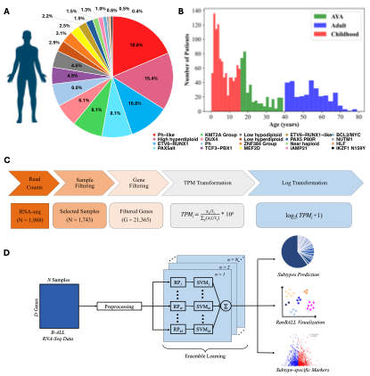

# RanBALL: An Ensemble Random Projection Model for Identifying Subtypes of B-cell Acute Lymphoblastic Leukemia

**RanBALL** (an Ensemble **Ran**dom Projection-Based Model for Identifying **B**-Cell **A**cute **L**ymphoblastic **L**eukemia Subtypes), an accurate and cost-effective model for B-ALL subtype identification based on transcriptomic profiling only. **RanBALL** leverages random projection (RP) to construct an ensemble of dimension-reduced multi-class classifiers for B-ALL subtyping.
## Flowchart of RanBALL


## Installation
1. Clone the RanBALL git repository
```bash
git clone https://github.com/wan-mlab/RanBALL.git
```
2. Navigate to the directory of RanBALL package
```bash
cd /your path/RanBALL
pip install .
```
## Tutorial
### Jupyter notebook
1. Modify the System Path and import module
```bash
import sys; sys.path.append('RanBALL')
from RanBALL import RanBALL
```
2. unzip and read the test file
```bash
test = pd.read_csv('filter_TPM_test.csv', index_col=0)
```
3. B-ALL subtype prediction
```bash
RanBALL.Predict(Exp = test, exp_type = 'TPM')
```
## Authors
Lusheng Li, Hanyu Xiao, Shibiao Wan
