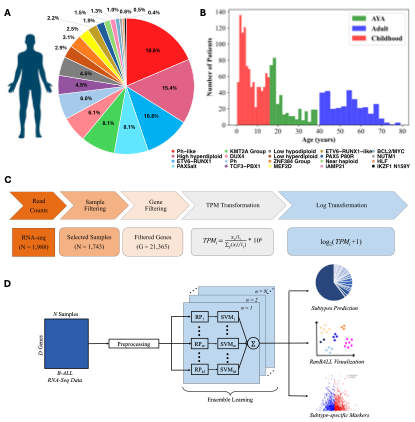
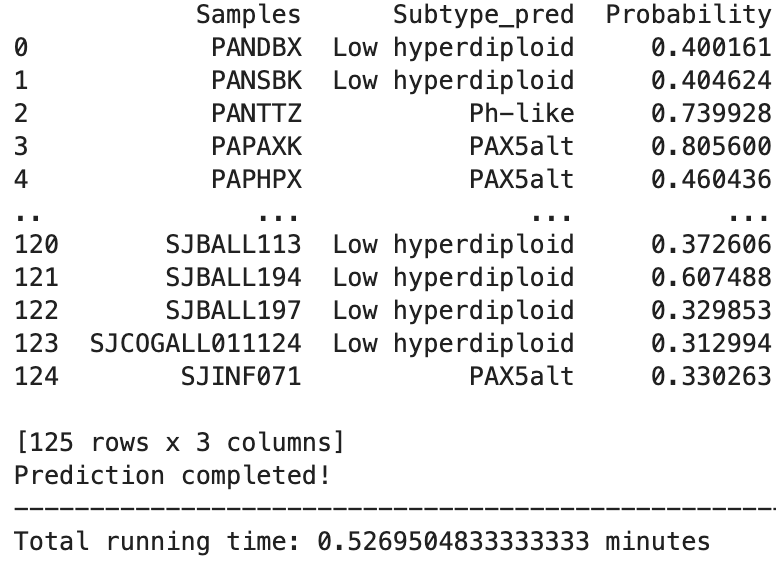

# RanBALL: An Ensemble Random Projection Model for Identifying Subtypes of B-cell Acute Lymphoblastic Leukemia

**RanBALL** (an Ensemble **Ran**dom Projection-Based Model for Identifying **B**-Cell **A**cute **L**ymphoblastic **L**eukemia Subtypes), an accurate and cost-effective model for B-ALL subtype identification based on transcriptomic profiling only. Leveraging the random projection and SVM techniques, our **RanBALL** enables to identify accurately and efficiently 20 distinct B-ALL subtypes, which could provide reliable diagnostic insights that can significantly aid clinical decision-making processes.

## Flowchart of RanBALL


## Table of Contents
- [Installation](#installation)
- [Tutorials](#Tutorials)
- [Bug Report](#Bug Report)
- [Authors](#Authors)
- [Publication](#Publication)
## Installation
1. Clone the RanBALL git repository
```bash
git clone https://github.com/wan-mlab/RanBALL.git
```
2. Navigate to the directory of RanBALL package
```bash
cd /your path/RanBALL
pip install .
```
## Tutorials
### Jupyter notebook
1. Modify the System Path and import module
```bash
import sys; sys.path.append('RanBALL')
from RanBALL import RanBALL
```
2. unzip and read the test file
```bash
test = pd.read_csv('filter_TPM_test.csv', index_col=0)
```
3. B-ALL subtype prediction
```bash
RanBALL.Predict(Exp = test, exp_type = 'TPM')
```
   exp_type also could be 'Raw_count' and 'FPKM', which would be transformed to TPM for model training.

4. Example Outputs



The prediction results will be stored and exported to the Prediction_results.csv

## Bug Report

If you find any bugs or problems, or you have any comments on RanBALL, please don't hesitate to contact via email lli@unmc.edu or [Issues](https://github.com/wan-mlab/RanBALL/issues).

## Authors
Lusheng Li, Hanyu Xiao, Xinchao Wu, Shibiao Wan

## Publication
RanBALL: Identifying B-cell acute lymphoblastic leukemia subtypes based on an ensemble random projection model, Cancer Research, vol. 84 (6_ Supplement), pp.4907-4907.
*Li, L.., Xiao, H., Khoury, J. D., Wang, J., & Wan, S*.*
[AACR Annual Meeting 2024, San Diego, CA, Apr. 2024](https://aacrjournals.org/cancerres/article/84/6_Supplement/4907/738413)

## License 

[](https://www.gnu.org/licenses/gpl-3.0)

GNU GENERAL PUBLIC LICENSE  
Version 3, 29 June 2007

This program is free software: you can redistribute it and/or modify
it under the terms of the GNU General Public License as published by
the Free Software Foundation, either version 3 of the License, or
(at your option) any later version.

This program is distributed in the hope that it will be useful,
but WITHOUT ANY WARRANTY; without even the implied warranty of
MERCHANTABILITY or FITNESS FOR A PARTICULAR PURPOSE.  See the
GNU General Public License for more details.

You should have received a copy of the GNU General Public License
along with this program.  If not, see <https://www.gnu.org/licenses/>.
